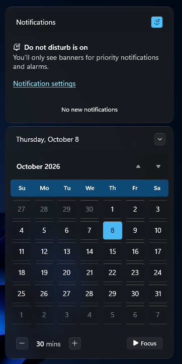
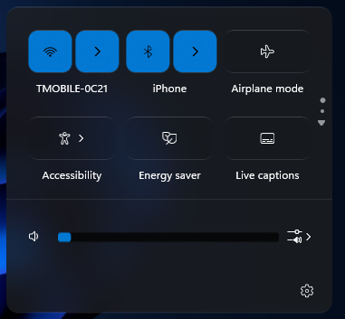

# Command Center theme for Windows 11 Notification Center Styler

**Author**: [PhantomNimbi](https://github.com/PhantomNimbi)

 

## Notes
- This theme consists of the following backgrounds:
  - Translucent
  - Glass
  - Frosted
  - Acrylic

  In order to switch between these backgrounds, set the value `Background=$Translucent`, `Background=$Glass`, `Background=$Frosted` or `Background=$Acrylic` in the "Style constants" section of the mod's settings.

- This theme can style your lock screen as well. 

## Additional Extras

- This theme goes great with various other Windhawk Mods. To see some pre-made configurations, check out my [`GitHub Pages`](https://helix-origin.github.io/Windhawk-Themes/catalogue/command-center/) site.

## Theme selection

The theme is integrated into the mod and can be selected directly from the mod's
settings:

* Open the Windows 11 Notification Center Styler mod in Windhawk.
* Go to the "Settings" tab.
* Select the theme and save the settings.

## Manual installation

The theme styles can also be imported manually. To do that, follow these steps:

* Open the Windows 11 Notification Center Styler mod in Windhawk.
* Go to the "Settings" tab and select "Textual mode".
* Copy the content below to the text box and click "Save settings".

<details>
<summary>Content to import (click to expand)</summary>

```yaml
styleConstants:
  - Translucent=<WindhawkBlur BlurAmount="15" TintColor="#10808080"/>
  - Glass=<WindhawkBlur BlurAmount="5" TintColor="{ThemeResource SystemChromeMediumColor}" TintOpacity="0.7" />
  - Frosted=<WindhawkBlur BlurAmount="20" TintColor="{ThemeResource SystemChromeMediumColor}" TintOpacity="0.7" />
  - Acrylic=<WindhawkBlur BlurAmount="30" TintColor="{ThemeResource SystemChromeMediumColor}" TintOpacity="0.8" />
  - Background=$Frosted
  - BorderBrush=<LinearGradientBrush StartPoint="0,0" EndPoint="0,1"><GradientStop Color="#60808080" Offset="0.0" /><GradientStop Color="#50404040" Offset="0.25" /><GradientStop Color="#40808080" Offset="1" /></LinearGradientBrush>
  - BorderBrush2=<WindhawkBlur BlurAmount="10" TintColor="#909090" TintOpacity="0.3"/>
  - OverlayColor=<AcrylicBrush TintColor="{ThemeResource SystemAltLowColor}" TintOpacity="1" TintLuminosityOpacity="0.8" FallbackColor="{ThemeResource CardStrokeColorDefaultSolid}" />
  - OverlayColor2=<AcrylicBrush TintColor="{ThemeResource SystemAltLowColor}" TintOpacity="1" TintLuminosityOpacity="0.5" FallbackColor="{ThemeResource CardStrokeColorDefaultSolid}" />
  - AccentColor=<AcrylicBrush TintColor="{ThemeResource SystemAccentColor}" TintOpacity="1" TintLuminosityOpacity="0.5" FallbackColor="{ThemeResource CardStrokeColorDefaultSolid}" />
  - ElementBackground=<SolidColorBrush Color="{ThemeResource SystemAltLowColor}" Opacity="0.25" />
  - BorderThickness=0.3,1,0.3,1
  - PanelRadius=13
  - CardRadius=10
  - ChipRadius=6
  - thumbnailImageSize=70
controlStyles:
  - target: Grid#NotificationCenterGrid
    styles:
      - Background:=$Background
      - BorderBrush:=$BorderBrush
      - BorderThickness=$BorderThickness
      - CornerRadius=$PanelRadius
      - Shadow:=
  - target: Grid#CalendarCenterGrid
    styles:
      - Background:=$Background
      - BorderBrush:=$BorderBrush
      - BorderThickness=$BorderThickness
      - CornerRadius=$PanelRadius
      - Shadow:=
      - Margin=0,6,0,6
      - MinHeight=40
  - target: ScrollViewer#CalendarControlScrollViewer
    styles:
      - Background:=$ElementBackground
      - CornerRadius=$CardRadius
      - Margin=-10,11,-10,-14
      - Shadow:=
  - target: Border#CalendarHeaderMinimizedOverlay
    styles:
      - Background:=$ElementBackground
      - CornerRadius=$CardRadius
      - Shadow:=
      - Margin=-10,-6,-10,-8
      - Height=45
  - target: ActionCenter.FocusSessionControl#FocusSessionControl > Grid#FocusGrid
    styles:
      - Background:=$ElementBackground
      - CornerRadius=$CardRadius
      - Margin=6,7,6,6
      - Shadow:=
  - target: MenuFlyoutPresenter
    styles:
      - Background:=$Background
      - BorderBrush:=$BorderBrush
      - BorderThickness=$BorderThickness
      - CornerRadius=$ChipRadius
      - Padding=1,2,1,2
      - Shadow:=
  - target: Border#JumpListRestyledAcrylic
    styles:
      - Background:=$Background
      - BorderBrush:=$BorderBrush
      - BorderThickness=$BorderThickness
      - CornerRadius=$ChipRadius
      - Margin=-2,-2,-2,-2
      - Shadow:=
  - target: Grid#ControlCenterRegion
    styles:
      - Background:=$Background
      - BorderBrush:=$BorderBrush
      - BorderThickness=$BorderThickness
      - CornerRadius=$PanelRadius
      - Shadow:=
      - Margin=0,0,0,-6
  - target: ContentPresenter#PageContent
    styles:
      - Background:=<SolidColorBrush Color="Transparent"/>
      - Shadow:=
  - target: ContentPresenter#PageContent > Grid > Border
    styles:
      - Background:=$ElementBackground
      - CornerRadius=$CardRadius
      - Margin=8,0,8,2
      - Shadow:=
  - target: QuickActions.ControlCenter.AccessibleWindow#PageWindow > ContentPresenter > Grid#FullScreenPageRoot
    styles:
      - Background:=<SolidColorBrush Color="Transparent"/>
      - Shadow:=
  - target: QuickActions.ControlCenter.AccessibleWindow#PageWindow > ContentPresenter > Grid#FullScreenPageRoot > ContentPresenter#PageHeader
    styles:
      - Background:=$ElementBackground
      - CornerRadius=$CardRadius
      - Margin=7,7,7,7
      - Shadow:=
  - target: ScrollViewer#ListContent
    styles:
      - Background:=$ElementBackground
      - CornerRadius=$CardRadius
      - Margin=8,0,8,0
      - Shadow:=
  - target: ActionCenter.FlexibleToastView#FlexibleNormalToastView
    styles:
      - Background:=<SolidColorBrush Color="Transparent"/>
      - Shadow:=
  - target: Border#ToastBackgroundBorder, Border#ToastBackgroundBorder2
    styles:
      - Background:=$Background
      - BorderBrush:=$BorderBrush
      - BorderThickness=$BorderThickness
      - CornerRadius=$CardRadius
      - Shadow:=
  - target: JumpViewUI.SystemItemListViewItem > Grid#LayoutRoot > Border#BackgroundBorder
    styles:
      - Background:=$ElementBackground
      - CornerRadius=$ChipRadius
  - target: JumpViewUI.JumpListListViewItem > Grid#LayoutRoot > Border#BackgroundBorder
    styles:
      - CornerRadius=$ChipRadius
  - target: ActionCenter.FlexibleItemView
    styles:
      - CornerRadius=$CardRadius
      - Shadow:=
  - target: QuickActions.AccessibleToggleButton#ToggleButton, ControlCenter.PaginatedToggleButton#ToggleButton
    styles:
      - CornerRadius=$CardRadius
      - BorderThickness=$BorderThickness
      - BorderBrush:=$BorderBrush
      - BorderBrush@Normal:=$BorderBrush
      - BorderBrush@PointerOver:=$BorderBrush
      - BorderBrush@Pressed:=$BorderBrush
      - BorderBrush@Checked:=$BorderBrush
      - BorderBrush@CheckedPointerOver:=$BorderBrush
      - BorderBrush@CheckedPressed:=$BorderBrush
      - BackgroundSizing=InnerBorderEdge
      - Background:=Transparent
  - target: QuickActions.AccessibleToggleButton#SplitL2Button, ControlCenter.PaginatedToggleButton#SplitL2Button, Button#SplitL2Button, Windows.UI.Xaml.Controls.Button#SplitL2Button
    styles:
      - CornerRadius=$CardRadius
      - Margin=4,0,-4,0
      - BorderThickness=$BorderThickness
      - BorderBrush:=$BorderBrush
      - BorderBrush@Normal:=$BorderBrush
      - BorderBrush@PointerOver:=$BorderBrush
      - BorderBrush@Pressed:=$BorderBrush
      - BorderBrush@Checked:=$BorderBrush
      - BorderBrush@CheckedPointerOver:=$BorderBrush
      - BorderBrush@CheckedPressed:=$BorderBrush
      - BackgroundSizing=InnerBorderEdge
      - Background:=Transparent
  - target: ControlCenter.PaginatedToggleButton > ContentPresenter#ContentPresenter@CommonStates, ControlCenter.PaginatedToggleButton > ContentPresenter@CommonStates, QuickActions.AccessibleToggleButton > ContentPresenter#ContentPresenter@CommonStates, QuickActions.AccessibleToggleButton > ContentPresenter@CommonStates, Button#SplitL2Button > ContentPresenter#ContentPresenter@CommonStates, Button#SplitL2Button > ContentPresenter@CommonStates, Windows.UI.Xaml.Controls.Button#SplitL2Button > Windows.UI.Xaml.Controls.ContentPresenter#ContentPresenter@CommonStates
    styles:
      - CornerRadius=$CardRadius
      - BorderThickness=$BorderThickness
      - BorderBrush:=$BorderBrush
      - BorderBrush@Normal:=$BorderBrush
      - BorderBrush@PointerOver:=$BorderBrush
      - BorderBrush@Pressed:=$BorderBrush
      - BorderBrush@Checked:=$BorderBrush
      - BorderBrush@CheckedPointerOver:=$BorderBrush
      - BorderBrush@CheckedPressed:=$BorderBrush
      - BackgroundSizing=InnerBorderEdge
      - Background@Normal:=$ElementBackground
      - Background@PointerOver:=$OverlayColor2
      - Background@Pressed:=$OverlayColor
      - Background@Checked:=$AccentColor
      - Background@CheckedPointerOver:=$AccentColor
      - Background@CheckedPressed:=$OverlayColor
      - Background@Disabled:=$ElementBackground
      - Background@CheckedDisabled:=$ElementBackground
  - target: QuickActions.AccessibleToggleButton#ToggleButton > ContentPresenter, ControlCenter.PaginatedToggleButton#ToggleButton > ContentPresenter, QuickActions.AccessibleToggleButton#SplitL2Button > ContentPresenter, ControlCenter.PaginatedToggleButton#SplitL2Button > ContentPresenter, Button#SplitL2Button > ContentPresenter, Windows.UI.Xaml.Controls.Button#SplitL2Button > Windows.UI.Xaml.Controls.ContentPresenter
    styles:
      - CornerRadius=$CardRadius
      - BorderThickness=$BorderThickness
      - BorderBrush:=$BorderBrush
      - BorderBrush@PointerOver:=$BorderBrush
      - BorderBrush@Pressed:=$BorderBrush
      - BackgroundSizing=InnerBorderEdge
  - target: Grid#NotificationCenterTopBanner
    styles:
      - Background:=$ElementBackground
      - CornerRadius=$CardRadius
      - Margin=6
  - target: Windows.UI.Xaml.Controls.Grid#L1Grid > Border
    styles:
      - Background:=<SolidColorBrush Color="Transparent"/>
  - target: Windows.UI.Xaml.Controls.Button#FooterButton[AutomationProperties.Name = Edit quick settings]
    styles:
      - Margin=0,0,8,0
      - CornerRadius=$ChipRadius
      - BorderThickness=$BorderThickness
      - BorderBrush:=$BorderBrush
      - BorderBrush@PointerOver:=$BorderBrush
      - BorderBrush@Pressed:=$BorderBrush
  - target: Windows.UI.Xaml.Controls.Button[AutomationProperties.AutomationId = Microsoft.QuickAction.Battery]
    styles:
      - Margin=2,0,0,0
      - CornerRadius=$ChipRadius
      - BorderThickness=$BorderThickness
      - BorderBrush:=$BorderBrush
      - BorderBrush@PointerOver:=$BorderBrush
      - BorderBrush@Pressed:=$BorderBrush
  - target: Windows.UI.Xaml.Controls.Button#FooterButton[AutomationProperties.Name = All settings]
    styles:
      - Margin=0,0,-1,0
      - CornerRadius=$PanelRadius
      - BorderThickness=$BorderThickness
      - BorderBrush:=$BorderBrush
      - BorderBrush@PointerOver:=$BorderBrush
      - BorderBrush@Pressed:=$BorderBrush
  - target: Windows.UI.Xaml.Controls.Button[AutomationProperties.AutomationId = Microsoft.QuickAction.Volume]
    styles:
      - CornerRadius=$CardRadius
      - BorderThickness=$BorderThickness
      - BorderBrush:=$BorderBrush
      - BorderBrush@PointerOver:=$BorderBrush
      - BorderBrush@Pressed:=$BorderBrush
  - target: Windows.UI.Xaml.Controls.Button#VolumeL2Button[AutomationProperties.Name = Select a sound output]
    styles:
      - CornerRadius=$CardRadius
      - BorderThickness=$BorderThickness
      - BorderBrush:=$BorderBrush
      - BorderBrush@PointerOver:=$BorderBrush
      - BorderBrush@Pressed:=$BorderBrush
  - target: Windows.UI.Xaml.Shapes.Rectangle#HorizontalTrackRect
    styles:
      - Height=10
      - Fill:=$OverlayColor
      - RadiusY=3
      - RadiusX=3
  - target: Windows.UI.Xaml.Shapes.Rectangle#HorizontalDecreaseRect
    styles:
      - Height=10
      - RadiusY=3
      - RadiusX=3
      - Margin=0
      - Fill:=$AccentColor
  - target: Windows.UI.Xaml.Controls.Primitives.Thumb#HorizontalThumb
    styles:
      - Visibility=1
  - target: Windows.UI.Xaml.Controls.Grid#MediaTransportControlsRegion
    styles:
      - Height=Auto
      - CornerRadius=$PanelRadius
      - BorderBrush:=$BorderBrush
      - BorderThickness=$BorderThickness
      - Background:=$Background
      - Shadow:=
      - Padding=0,0,0,12
      - Margin=0,0,0,12
  - target: Windows.UI.Xaml.Controls.Grid#ThumbnailImage
    styles:
      - Width=$thumbnailImageSize
      - Height=$thumbnailImageSize
      - HorizontalAlignment=Right
      - VerticalAlignment=Center
      - Grid.Column=1
      - Margin=0,0,8,0
      - CornerRadius=$CardRadius
  - target: Windows.UI.Xaml.Controls.StackPanel#PrimaryAndSecondaryTextContainer
    styles:
      - VerticalAlignment=Center
      - Margin=0,0,0,0
      - Grid.Column=0
  - target: Windows.UI.Xaml.Controls.ListView#MediaButtonsListView
    styles:
      - VerticalAlignment=Center
      - Height=40
      - Margin=0,4,0,0
  - target: Windows.UI.Xaml.Controls.Primitives.RepeatButton#PreviousButton > Windows.UI.Xaml.Controls.ContentPresenter#ContentPresenter@CommonStates
    styles:
      - Background@Normal:=$OverlayColor2
      - Background@PointerOver:=$AccentColor
      - Background@Pressed:=$OverlayColor
      - BorderThickness=$BorderThickness
      - BorderBrush:=$BorderBrush
      - BorderBrush@PointerOver:=$BorderBrush
      - BorderBrush@Pressed:=$BorderBrush
      - Width=36
      - Height=28
      - CornerRadius=$ChipRadius
      - Margin=4,0,4,0
  - target: Windows.UI.Xaml.Controls.Button#PlayPauseButton > Windows.UI.Xaml.Controls.ContentPresenter#ContentPresenter@CommonStates
    styles:
      - Background@Normal:=$OverlayColor2
      - Background@PointerOver:=$AccentColor
      - Background@Pressed:=$OverlayColor
      - BorderThickness=$BorderThickness
      - BorderBrush:=$BorderBrush
      - BorderBrush@PointerOver:=$BorderBrush
      - BorderBrush@Pressed:=$BorderBrush
      - Width=36
      - Height=36
      - CornerRadius=$ChipRadius
      - Margin=4,0,4,0
  - target: Windows.UI.Xaml.Controls.Primitives.RepeatButton#NextButton > Windows.UI.Xaml.Controls.ContentPresenter#ContentPresenter@CommonStates
    styles:
      - Background@Normal:=$OverlayColor2
      - Background@PointerOver:=$AccentColor
      - Background@Pressed:=$OverlayColor
      - BorderThickness=$BorderThickness
      - BorderBrush:=$BorderBrush
      - BorderBrush@PointerOver:=$BorderBrush
      - BorderBrush@Pressed:=$BorderBrush
      - Width=36
      - Height=28
      - CornerRadius=$ChipRadius
      - Margin=4,0,4,0
  - target: Grid#MediaTransportControlsRoot
    styles:
      - Background:=<SolidColorBrush Color="Transparent"/>
  - target: Grid#ToastPeekRegion
    styles:
      - Background=
      - RenderTransform:=<TranslateTransform Y="-495" X="395" />
      - Grid.Column=0
      - Grid.Row=2
  - target: CalendarViewDayItem, Windows.UI.Xaml.Controls.CalendarViewDayItem
    styles:
      - CornerRadius=4
      - BorderThickness=$BorderThickness
      - BorderBrush:=$BorderBrush
      - BorderBrush@PointerOver:=$BorderBrush
      - BorderBrush@Pressed:=$BorderBrush
      - Background:=$ElementBackground
      - Background@PointerOver:=$OverlayColor2
      - Background@Pressed:=$OverlayColor
  - target: CalendarViewDayItem > Border, Windows.UI.Xaml.Controls.CalendarViewDayItem > Windows.UI.Xaml.Controls.Border
    styles:
      - CornerRadius=4
      - Margin=1,2,1,2
      - BorderThickness=$BorderThickness
      - BorderBrush:=$BorderBrush
  - target: CalendarViewItem, Windows.UI.Xaml.Controls.Primitives.CalendarViewItem
    styles:
      - CornerRadius=4
      - BorderThickness=$BorderThickness
      - BorderBrush:=$BorderBrush
      - BorderBrush@PointerOver:=$BorderBrush
      - BorderBrush@Pressed:=$BorderBrush
      - Background:=$ElementBackground
      - Background@PointerOver:=$OverlayColor2
      - Background@Pressed:=$OverlayColor
  - target: Control > Border, Windows.UI.Xaml.Controls.Control > Windows.UI.Xaml.Controls.Border
    styles:
      - CornerRadius=4
      - BorderThickness=$BorderThickness
      - BorderBrush:=$BorderBrush
  - target: Windows.UI.Xaml.Controls.ListViewHeaderItem
    styles:
      - Margin=5,6,5,2
      - CornerRadius=$CardRadius
      - Height=35
  - target: Windows.UI.Xaml.Controls.Button#SettingsButton
    styles:
      - CornerRadius=$ChipRadius
      - BorderThickness=$BorderThickness
      - BorderBrush:=$BorderBrush
      - BorderBrush@PointerOver:=$BorderBrush
      - BorderBrush@Pressed:=$BorderBrush
  - target: Windows.UI.Xaml.Controls.Button#DismissButton
    styles:
      - CornerRadius=$ChipRadius
      - BorderThickness=$BorderThickness
      - BorderBrush:=$BorderBrush
      - BorderBrush@PointerOver:=$BorderBrush
      - BorderBrush@Pressed:=$BorderBrush
  - target: Windows.UI.Xaml.Controls.StackPanel#CalendarHeader
    styles:
      - Margin=6,0,0,0
  - target: Windows.UI.Xaml.Controls.ScrollContentPresenter#ScrollContentPresenter
    styles:
      - Margin=1,2,1,2
  - target: Windows.UI.Xaml.Controls.Grid#WeekDayNames
    styles:
      - Background:=<SolidColorBrush Color="{ThemeResource SystemAccentColorLight1}" Opacity="0.4" />
      - CornerRadius=4
      - Margin=4,0,4,0
      - Padding=0,-5,0,-3
  - target: Windows.UI.Xaml.Controls.ListViewItem
    styles:
      - CornerRadius=$ChipRadius
  - target: Windows.UI.Xaml.Controls.Grid#RootGrid > Windows.UI.Xaml.Controls.ContentPresenter#ContentPresenter
    styles:
      - Background:=$OverlayColor2
      - BorderThickness=0
      - CornerRadius=$ChipRadius
  - target: Windows.UI.Xaml.Controls.Grid > Windows.UI.Xaml.Controls.Border#ItemOpaquePlating
    styles:
      - Background:=$OverlayColor2
      - BorderThickness=0
      - CornerRadius=$ChipRadius
  - target: Windows.UI.Xaml.Controls.Grid#StandardHeroContainer
    styles:
      - Margin=12,0,12,0
      - CornerRadius=0
      - Height=150
  - target: Windows.UI.Xaml.Controls.Primitives.ScrollBar#VerticalScrollBar
    styles:
      - Visibility=1
  - target: Windows.UI.Xaml.Controls.Grid#SliderContainer
    styles:
      - Margin=0,-2,0,0
  - target: Windows.UI.Xaml.Controls.Button#BackButton
    styles:
      - CornerRadius=$ChipRadius
      - BorderThickness=$BorderThickness
      - BorderBrush:=$BorderBrush
      - BorderBrush@PointerOver:=$BorderBrush
      - BorderBrush@Pressed:=$BorderBrush
  - target: Windows.UI.Xaml.Shapes.Rectangle#OuterBorder
    styles:
      - RadiusX=6
      - RadiusY=6
      - Height=18
  - target: Windows.UI.Xaml.Shapes.Rectangle#SwitchKnobOff
    styles:
      - RadiusY=3
      - RadiusX=3
  - target: Windows.UI.Xaml.Controls.Border#SwitchKnobOn
    styles:
      - CornerRadius=3
  - target: Windows.UI.Xaml.Shapes.Rectangle#SwitchKnobBounds
    styles:
      - RadiusX=6
      - RadiusY=6
      - Height=18
  - target: ActionCenter.NotificationListViewItem
    styles:
      - Margin=5,2,5,3
      - CornerRadius=$CardRadius
      - BorderThickness=$BorderThickness
      - BorderBrush@PointerOver:=$BorderBrush
      - BorderBrush@Pressed:=$BorderBrush
  - target: Windows.UI.Xaml.Controls.Grid[AutomationProperties.LocalizedLandmarkType = Footer]
    styles:
      - BorderThickness=0
  - target: NetworkUX.View.SettingsListViewItem > Windows.UI.Xaml.Controls.Primitives.ListViewItemPresenter#Root
    styles:
      - CornerRadius=$CardRadius
  - target: Button#ClearAll
    styles:
      - AccessKey=x
      - CornerRadius=$ChipRadius
      - BorderThickness=$BorderThickness
      - BorderBrush:=$BorderBrush
      - BorderBrush@PointerOver:=$BorderBrush
      - BorderBrush@Pressed:=$BorderBrush
      - Background@PointerOver:=$OverlayColor2
      - Background@Pressed:=$OverlayColor
  - target: Button#ExpandCollapseButton
    styles:
      - AccessKey=e
      - CornerRadius=$ChipRadius
      - BorderThickness=$BorderThickness
      - BorderBrush:=$BorderBrush
      - BorderBrush@PointerOver:=$BorderBrush
      - BorderBrush@Pressed:=$BorderBrush
      - Background@PointerOver:=$OverlayColor2
      - Background@Pressed:=$OverlayColor
  - target: Button > Grid@CommonStates > Border#BackgroundBorder
    styles:
      - BorderThickness=$BorderThickness
      - BorderBrush@PointerOver:=$BorderBrush
      - BorderBrush@Pressed:=$BorderBrush
      - CornerRadius=$ChipRadius
      - BackgroundSizing=InnerBorderEdge
  - target: ListViewItem > Grid@CommonStates > Border#BackgroundBorder, ListViewItem > Grid@CommonStates > Border#BorderBackground
    styles:
      - BorderThickness=$BorderThickness
      - BorderBrush@PointerOver:=$BorderBrush
      - BorderBrush@Pressed:=$BorderBrush
      - CornerRadius=$ChipRadius
      - BackgroundSizing=InnerBorderEdge
```
</details>
